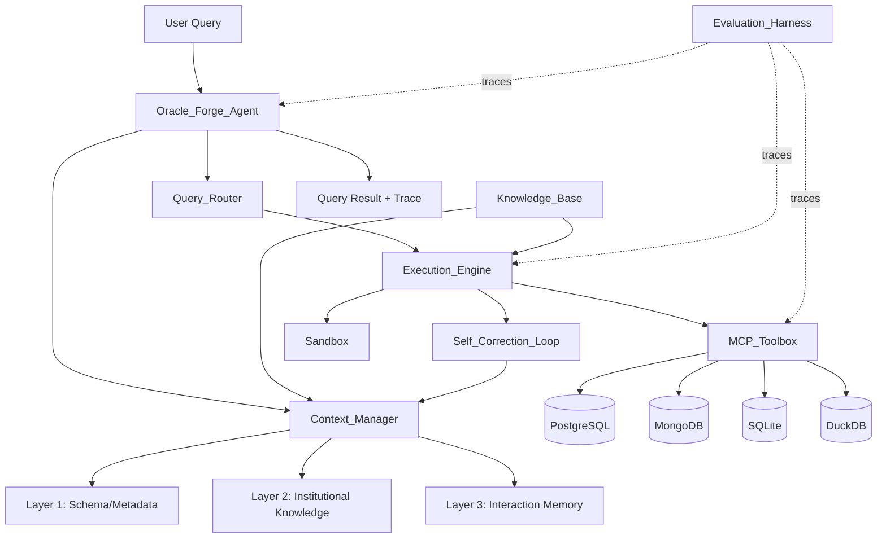
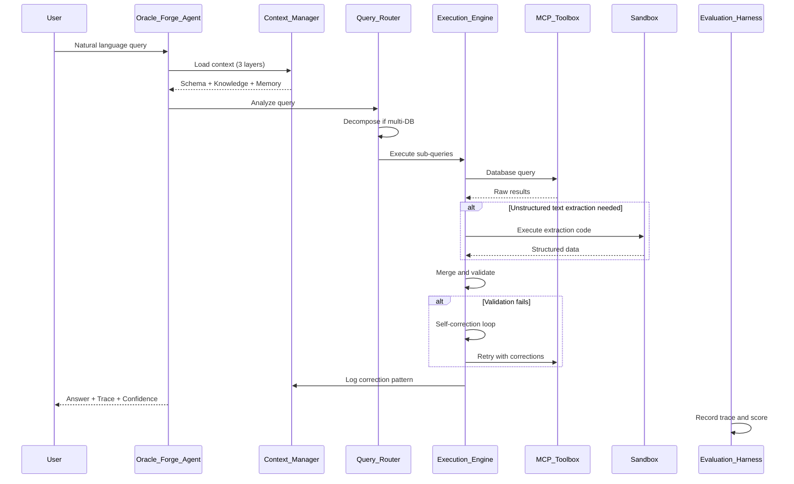
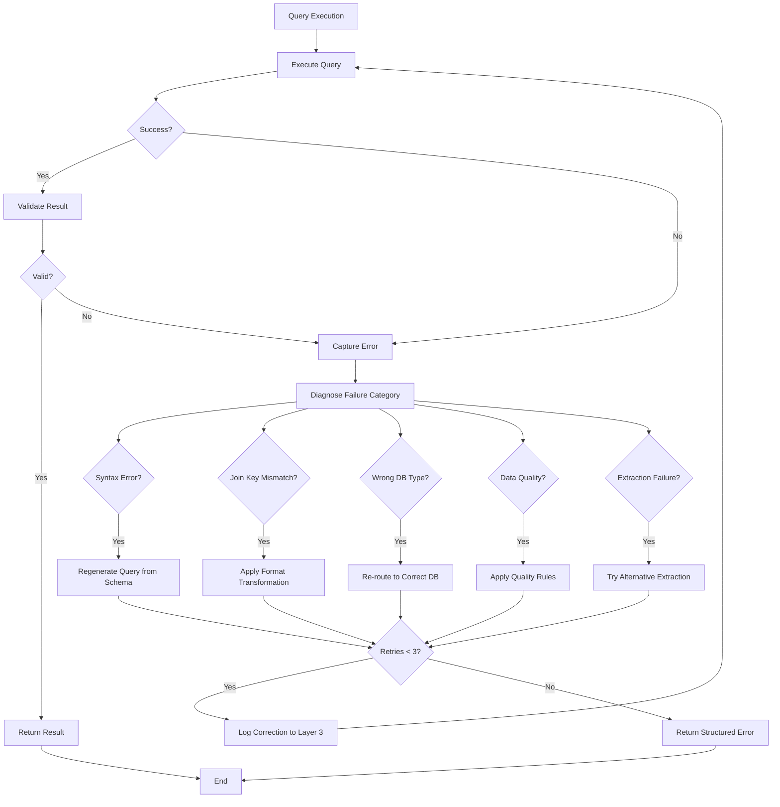

# Design Document: Oracle Forge Data Agent

## Overview

The Oracle Forge is a production-grade data analytics agent system that answers complex business questions against heterogeneous database environments. The system implements a three-layer context architecture, self-correcting execution engine, and comprehensive evaluation harness to compete on the DataAgentBench (DAB) benchmark.

The agent addresses the fundamental challenge in production data agents: context management. While raw LLM capability can generate queries, reliable operation requires understanding database schemas across multiple systems, institutional knowledge about business terminology and data formats, and interaction memory to learn from corrections. The system handles PostgreSQL, MongoDB, SQLite, and DuckDB databases within single query sessions, resolves ill-formatted join keys automatically, extracts structured data from unstructured text fields, and applies domain knowledge to disambiguate business terms.

The architecture follows patterns from Claude Code's three-layer memory system and OpenAI's six-layer data agent context design, adapted for the specific requirements of multi-database enterprise analytics. The evaluation harness applies event sourcing principles from Week 5 Ledger system to produce measurable improvement tracking across benchmark runs.

## Architecture

### System Components

The system consists of eight primary components organized into three tiers:

**Agent Tier:**
- Oracle_Forge_Agent: Primary AI agent coordinating query processing
- Context_Manager: Three-layer context architecture manager

**Execution Tier:**
- Query_Router: Multi-database query routing and decomposition
- Execution_Engine: Query execution with self-correction loop
- Sandbox: Isolated code execution environment

**Infrastructure Tier:**
- Knowledge_Base: Structured domain knowledge repository
- MCP_Toolbox: Standardized database connection interface
- Evaluation_Harness: Tool call tracing and scoring system



### Data Flow

Query processing follows this sequence:

1. User submits natural language query with available databases and schema information
2. Oracle_Forge_Agent loads context from Context_Manager (all three layers)
3. Query_Router analyzes query to determine required databases and decompose if needed
4. Execution_Engine translates sub-queries to appropriate dialects (SQL, MongoDB aggregation)
5. MCP_Toolbox executes queries against target databases
6. For unstructured text transformation, Sandbox executes extraction code
7. Execution_Engine merges results and validates against expected format
8. Self_Correction_Loop detects failures, diagnoses root cause, and retries with corrections
9. Context_Manager logs successful patterns and corrections to Layer 3
10. Evaluation_Harness traces all tool calls and produces outcome scores



### Integration with External Systems

**DataAgentBench Integration:**
- Agent accepts DAB query format: `{question, available_databases, schema_info}`
- Returns DAB result format: `{answer, query_trace, confidence}`
- Evaluation_Harness produces results JSON conforming to DAB submission schema
- Submission via GitHub PR to ucbepic/DataAgentBench repository

**tenai-infra Deployment:**
- Deployed on shared server with Tailscale mesh networking
- tmux sessions for persistent multi-user access
- Gemini CLI conductor for parallel agent session management
- Git worktrees for isolated experimental branches

**MCP Toolbox Integration:**
- Single tools.yaml configuration file defines all database connections
- Agent calls database operations via MCP protocol, not direct drivers
- Toolbox exposes: list_databases, query_schema, execute_query, validate_results

## Components and Interfaces

### Oracle_Forge_Agent

Primary AI agent coordinating query processing and response generation.

**Responsibilities:**
- Accept natural language queries in DAB format
- Coordinate Context_Manager, Query_Router, and Execution_Engine
- Generate final answers with confidence scores
- Maintain conversation state across multi-turn interactions

**Interface:**

```python
class OracleForgeAgent:
    def process_query(
        self,
        question: str,
        available_databases: List[str],
        schema_info: Dict[str, Any]
    ) -> QueryResult:
        """
        Process a natural language query against available databases.
        
        Args:
            question: Natural language query text
            available_databases: List of database identifiers accessible for this query
            schema_info: Schema metadata for available databases
            
        Returns:
            QueryResult containing answer, trace, and confidence score
        """
        pass
    
    def load_session_context(self, session_id: str) -> None:
        """Load context layers for a session."""
        pass
    
    def update_interaction_memory(
        self,
        query: str,
        correction: str,
        pattern: str
    ) -> None:
        """Update Layer 3 with user corrections and successful patterns."""
        pass
```

**Configuration:**
- LLM model: Claude 3.5 Sonnet or equivalent
- Context window: Minimum 100K tokens for full context loading
- Temperature: 0.0 for deterministic query generation
- Max retries: 3 attempts via Self_Correction_Loop

### Context_Manager

Manages three-layer context architecture providing schema, institutional knowledge, and interaction memory.

**Layer 1: Schema and Metadata**
- Table structures, column types, relationships for all connected databases
- Populated at system initialization via schema introspection
- Updated when database schemas change
- Format: Structured JSON with table definitions, foreign key relationships, index information

**Layer 2: Institutional Knowledge**
- Business term definitions (e.g., "active customer" = purchased in last 90 days)
- Authoritative table designations (which tables are current vs deprecated)
- Join key glossary documenting ID format variations across databases
- Unstructured field inventory identifying free-text fields requiring extraction
- Domain-specific rules (fiscal calendar conventions, status code meanings)
- Format: Markdown documents in Knowledge_Base, loaded at session start

**Layer 3: Interaction Memory**
- User corrections from previous queries
- Successful query patterns that worked
- User preferences (output format, aggregation preferences)
- Failure patterns and their resolutions
- Format: Structured log entries with query, failure cause, correction applied

**Interface:**

```python
class ContextManager:
    def load_all_layers(self, session_id: str) -> ContextBundle:
        """Load all three context layers for a session."""
        pass
    
    def get_schema_for_databases(
        self,
        database_ids: List[str]
    ) -> Dict[str, SchemaInfo]:
        """Retrieve Layer 1 schema information for specified databases."""
        pass
    
    def resolve_business_term(self, term: str, domain: str) -> str:
        """Resolve ambiguous business term using Layer 2 knowledge."""
        pass
    
    def get_join_key_format(
        self,
        database_a: str,
        database_b: str,
        entity_type: str
    ) -> JoinKeyMapping:
        """Retrieve join key format mapping from Layer 2."""
        pass
    
    def log_correction(
        self,
        query: str,
        failure_cause: str,
        correction: str
    ) -> None:
        """Add correction entry to Layer 3."""
        pass
    
    def get_similar_corrections(self, query: str) -> List[CorrectionEntry]:
        """Retrieve Layer 3 corrections similar to current query."""
        pass
```

**Storage:**
- Layer 1: PostgreSQL metadata tables or JSON files per database
- Layer 2: Knowledge_Base markdown documents in kb/domain/
- Layer 3: Append-only log file or event store (Week 5 Ledger pattern)

### Query_Router

Routes query components to appropriate database systems and decomposes multi-database queries.

**Responsibilities:**
- Analyze query to determine required databases
- Decompose queries spanning multiple databases into sub-queries
- Determine execution order based on data dependencies
- Handle query dialect differences (SQL vs MongoDB aggregation vs DuckDB analytical SQL)

**Routing Logic:**
- Parse query to identify entity types mentioned (customers, orders, reviews, etc.)
- Match entity types to databases using Layer 1 schema information
- Detect join operations requiring data from multiple databases
- Create execution plan with sub-query sequence

**Interface:**

```python
class QueryRouter:
    def analyze_query(
        self,
        query: str,
        available_databases: List[str],
        schema_info: Dict[str, Any]
    ) -> QueryPlan:
        """
        Analyze query and produce execution plan.
        
        Returns:
            QueryPlan with sub-queries, target databases, execution order
        """
        pass
    
    def decompose_multi_database_query(
        self,
        query: str,
        databases: List[str]
    ) -> List[SubQuery]:
        """Decompose query into database-specific sub-queries."""
        pass
    
    def determine_join_strategy(
        self,
        left_db: str,
        right_db: str,
        join_key: str
    ) -> JoinStrategy:
        """Determine how to join results from different databases."""
        pass
```

**Query Plan Structure:**

```python
@dataclass
class QueryPlan:
    sub_queries: List[SubQuery]
    execution_order: List[int]  # Indices into sub_queries
    join_operations: List[JoinOp]
    requires_sandbox: bool  # True if unstructured text extraction needed
```

### Execution_Engine

Executes database queries with self-correction on failures.

**Responsibilities:**
- Translate sub-queries to appropriate database dialects
- Execute queries via MCP_Toolbox
- Merge results from multiple databases
- Validate results against expected format and data types
- Implement Self_Correction_Loop for failure recovery

**Dialect Translation:**
- PostgreSQL/SQLite/DuckDB: Standard SQL with dialect-specific functions
- MongoDB: Aggregation pipeline JSON
- Handle differences in date functions, string operations, aggregation syntax

**Result Merging:**
- Join results on specified keys after format resolution
- Handle null values consistently across database types
- Preserve data types during merge operations
- Detect and report referential integrity violations

**Interface:**

```python
class ExecutionEngine:
    def execute_plan(
        self,
        plan: QueryPlan,
        context: ContextBundle
    ) -> ExecutionResult:
        """Execute query plan with self-correction."""
        pass
    
    def translate_to_dialect(
        self,
        sub_query: SubQuery,
        target_db_type: str
    ) -> str:
        """Translate sub-query to target database dialect."""
        pass
    
    def merge_results(
        self,
        results: List[QueryResult],
        join_ops: List[JoinOp]
    ) -> MergedResult:
        """Merge results from multiple databases."""
        pass
    
    def validate_result(
        self,
        result: Any,
        expected_schema: Dict[str, Any]
    ) -> ValidationResult:
        """Validate result format and data types."""
        pass
    
    def apply_format_transformation(
        self,
        value: Any,
        source_format: str,
        target_format: str
    ) -> Any:
        """Transform join key formats for cross-database joins."""
        pass
```

### Self_Correction_Loop

Detects failures, diagnoses root causes, and implements recovery strategies.

**Failure Categories:**
1. Query syntax error (malformed SQL, invalid aggregation pipeline)
2. Join key format mismatch (integer vs formatted string)
3. Wrong database type (queried MongoDB with SQL)
4. Data quality issue (unexpected nulls, referential integrity violation)
5. Unstructured text extraction failure

**Diagnosis Process:**
- Capture error message and execution trace
- Pattern match error against known failure categories
- Check Layer 3 for similar past failures and their resolutions
- Consult Layer 2 join key glossary if join operation failed

**Recovery Strategies:**

```python
class SelfCorrectionLoop:
    def detect_failure(
        self,
        execution_result: ExecutionResult
    ) -> Optional[FailureInfo]:
        """Detect if execution failed and classify failure type."""
        pass
    
    def diagnose_root_cause(
        self,
        failure: FailureInfo,
        context: ContextBundle
    ) -> Diagnosis:
        """Determine root cause of failure."""
        pass
    
    def generate_correction(
        self,
        diagnosis: Diagnosis,
        original_query: str
    ) -> CorrectionStrategy:
        """Generate correction strategy for diagnosed failure."""
        pass
    
    def retry_with_correction(
        self,
        original_plan: QueryPlan,
        correction: CorrectionStrategy,
        max_attempts: int = 3
    ) -> ExecutionResult:
        """Retry execution with correction applied."""
        pass
```

**Recovery Examples:**
- Join key mismatch: Apply format transformation from Layer 2 glossary
- Query syntax: Regenerate query using schema from Layer 1
- Wrong database: Re-route to correct database based on entity type
- Data quality: Apply null handling or filter invalid records

### Knowledge_Base

Structured repository of domain knowledge following Karpathy method.

**Directory Structure:**
```
kb/
├── architecture/
│   ├── claude_code_memory.md
│   ├── openai_context_layers.md
│   ├── tool_scoping.md
│   └── CHANGELOG.md
├── domain/
│   ├── dab_schemas.md
│   ├── join_key_glossary.md
│   ├── unstructured_fields.md
│   ├── business_terms.md
│   └── CHANGELOG.md
├── evaluation/
│   ├── dab_format.md
│   ├── scoring_method.md
│   ├── failure_categories.md
│   └── CHANGELOG.md
└── corrections/
    ├── corrections_log.md
    └── CHANGELOG.md
```

**Document Requirements:**
- Maximum 400 words per document
- Verified via injection test before deployment
- Specific to this problem domain (no general LLM knowledge)
- Maintained with CHANGELOG.md tracking additions and removals

**Injection Test Protocol:**
1. Load document into fresh LLM context (no other context)
2. Ask question the document should answer
3. Verify correct answer produced
4. If incorrect, revise document or remove

**Interface:**

```python
class KnowledgeBase:
    def load_documents(self, directory: str) -> List[Document]:
        """Load all documents from specified KB directory."""
        pass
    
    def verify_document(self, doc: Document) -> bool:
        """Run injection test to verify document quality."""
        pass
    
    def add_correction(
        self,
        query: str,
        failure: str,
        correction: str
    ) -> None:
        """Add entry to corrections log."""
        pass
    
    def search_corrections(self, query: str) -> List[CorrectionEntry]:
        """Search corrections log for similar queries."""
        pass
```

### MCP_Toolbox

Standardized database connection interface using a hybrid approach:

- **PostgreSQL, MongoDB, SQLite** → [Google MCP Toolbox for Databases](https://github.com/googleapis/mcp-toolbox) binary running as an HTTP server on `localhost:5000`
- **DuckDB** → direct `duckdb` Python driver (Google MCP Toolbox does not support DuckDB)

**Startup (required before agent runs):**

```bash
# Download binary (check googleapis/mcp-toolbox for latest version)
export VERSION=0.30.0
curl -O https://storage.googleapis.com/genai-toolbox/v$VERSION/linux/amd64/toolbox
chmod +x toolbox

# Start the toolbox server
./toolbox --config mcp/tools.yaml
# Verify: curl http://localhost:5000/v1/tools
```

**Configuration (mcp/tools.yaml) — Google MCP Toolbox multi-document YAML format:**

```yaml
kind: source
name: postgres_shared
type: postgres
host: ${PG_HOST}
port: ${PG_PORT}
database: postgres
user: ${PG_USER}
password: ${PG_PASSWORD}
---
kind: source
name: mongo_shared
type: mongodb
uri: ${MONGO_URI}
---
kind: source
name: sqlite_crm_core
type: sqlite
database: /DataAgentBench/query_crmarenapro/query_dataset/core_crm.db
---
# DuckDB sources — handled by direct Python driver, not toolbox binary
kind: source
name: duckdb_crm_sales_pipeline
type: duckdb
database: /DataAgentBench/query_crmarenapro/query_dataset/sales_pipeline.duckdb
---
kind: tool
name: postgres_query
type: postgres-sql
source: postgres_shared
description: Run a read-only SQL query against PostgreSQL.
parameters:
  - name: sql
    type: string
statement: "{{.sql}}"
---
kind: tool
name: crm_core_query
type: sqlite-execute-sql
source: sqlite_crm_core
description: Query the crmarenapro core CRM SQLite database.
---
kind: tool
name: mongo_find
type: mongodb-find
source: mongo_shared
description: Find documents in MongoDB collections.
```

**Routing logic:**

| Database type | Route | Reason |
|---|---|---|
| PostgreSQL | HTTP → toolbox binary | Supported natively |
| MongoDB | HTTP → toolbox binary | Supported natively |
| SQLite | HTTP → toolbox binary | Supported natively |
| DuckDB | Direct `duckdb` driver | Not supported by Google MCP Toolbox |

**Interface:**

```python
class MCPToolbox:
    def call_tool(
        self,
        tool_name: str,
        parameters: Dict[str, Any]
    ) -> ToolResult:
        """
        Invoke a named tool.
        Routes to HTTP toolbox server or direct duckdb driver based on source type.
        """
        pass

    def verify_connections(self) -> Dict[str, bool]:
        """
        Check all configured sources.
        Toolbox sources: verified via GET /v1/tools health check.
        DuckDB sources: verified by opening a direct connection.
        """
        pass

    def list_tools(self) -> List[Dict[str, Any]]:
        """Return tools registered in the running toolbox binary (GET /v1/tools)."""
        pass
```

### Sandbox

Isolated code execution environment for data transformation.

**Responsibilities:**
- Execute agent-generated code for unstructured text extraction
- Enforce resource limits (execution time, memory, network access)
- Validate code before execution
- Return structured results with execution trace

**Security Constraints:**
- No network access except to specified databases
- Maximum execution time: 30 seconds
- Maximum memory: 512MB
- No file system write access outside designated temp directory
- Code validation: Check for prohibited operations (eval, exec, import restrictions)

**Deployment Options:**
1. Local container (Docker) on tenai-infra
2. Cloudflare Workers (serverless, free tier available)

**Interface:**

```python
class Sandbox:
    def execute_code(
        self,
        code: str,
        input_data: Any,
        timeout: int = 30
    ) -> SandboxResult:
        """
        Execute code in isolated environment.
        
        Args:
            code: Python code to execute
            input_data: Input data for code
            timeout: Maximum execution time in seconds
            
        Returns:
            SandboxResult with output, trace, and any errors
        """
        pass
    
    def validate_code(self, code: str) -> ValidationResult:
        """Validate code before execution."""
        pass
```

**Sandbox Result Structure:**

```python
@dataclass
class SandboxResult:
    success: bool
    output: Any
    execution_time: float
    memory_used: int
    trace: List[str]
    error: Optional[str]
    error_category: Optional[str]  # syntax, timeout, memory, prohibited_operation
```

### Evaluation_Harness

Traces tool calls, records outcomes, and produces measurable improvement scores.

**Responsibilities:**
- Trace every tool call with parameters and results
- Record query outcomes against DAB ground truth
- Calculate Pass@1 score (percentage correct on first attempt)
- Generate structured trace logs following Week 5 Ledger event sourcing schema
- Support regression testing against held-out test set
- Produce score logs showing improvement over time

**Trace Schema (Event Sourcing Pattern):**

```python
@dataclass
class ToolCallEvent:
    event_id: str
    timestamp: datetime
    session_id: str
    tool_name: str
    parameters: Dict[str, Any]
    result_status: str  # success, failure, retry
    execution_time: float
    error: Optional[str]

@dataclass
class QueryEvent:
    event_id: str
    timestamp: datetime
    session_id: str
    query_text: str
    available_databases: List[str]
    tool_calls: List[str]  # References to ToolCallEvent IDs
    answer: Any
    expected_answer: Any
    correct: bool
    confidence: float
    correction_applied: bool
```

**Scoring:**

```python
class EvaluationHarness:
    def trace_tool_call(
        self,
        tool_name: str,
        parameters: Dict[str, Any],
        result: Any,
        execution_time: float
    ) -> str:
        """Record tool call and return event ID."""
        pass
    
    def record_query_outcome(
        self,
        query: str,
        answer: Any,
        expected: Any,
        tool_call_ids: List[str]
    ) -> None:
        """Record query outcome against expected result."""
        pass
    
    def calculate_pass_at_1(
        self,
        results: List[QueryEvent]
    ) -> float:
        """Calculate Pass@1 score from query results."""
        pass
    
    def generate_score_log(
        self,
        baseline_score: float,
        current_score: float,
        timestamp: datetime
    ) -> ScoreLogEntry:
        """Generate score log entry showing improvement."""
        pass
    
    def run_regression_suite(
        self,
        test_set: List[Query]
    ) -> RegressionResult:
        """Run agent against held-out test set."""
        pass
    
    def export_dab_results(
        self,
        results: List[QueryEvent],
        output_path: str
    ) -> None:
        """Export results in DAB submission format."""
        pass
```

**DAB Results Format:**

```json
{
  "team_name": "string",
  "submission_date": "ISO-8601",
  "agent_version": "string",
  "results": [
    {
      "query_id": "string",
      "trials": [
        {
          "trial_number": 1,
          "answer": "any",
          "correct": true,
          "execution_time": 2.5,
          "tool_calls": 4,
          "correction_applied": false
        }
      ]
    }
  ],
  "pass_at_1": 0.42,
  "total_queries": 54,
  "trials_per_query": 5
}
```

## Data Models

### Query Processing Models

```python
@dataclass
class Query:
    """User query in DAB format."""
    question: str
    available_databases: List[str]
    schema_info: Dict[str, Any]
    session_id: Optional[str] = None

@dataclass
class QueryResult:
    """Agent response in DAB format."""
    answer: Any
    query_trace: List[ToolCallEvent]
    confidence: float
    execution_time: float
    correction_applied: bool

@dataclass
class SubQuery:
    """Component of decomposed multi-database query."""
    query_text: str
    target_database: str
    database_type: str  # postgresql, mongodb, sqlite, duckdb
    depends_on: List[int]  # Indices of sub-queries that must complete first
    extraction_required: bool

@dataclass
class QueryPlan:
    """Execution plan for query."""
    sub_queries: List[SubQuery]
    execution_order: List[int]
    join_operations: List[JoinOp]
    requires_sandbox: bool

@dataclass
class JoinOp:
    """Join operation between sub-query results."""
    left_subquery_idx: int
    right_subquery_idx: int
    join_key_left: str
    join_key_right: str
    join_type: str  # inner, left, right, full
    format_transformation: Optional[FormatTransform]

@dataclass
class FormatTransform:
    """Format transformation for join key resolution."""
    source_format: str  # e.g., "integer"
    target_format: str  # e.g., "CUST-{:05d}"
    transformation_function: str  # Python expression
```

### Context Layer Models

```python
@dataclass
class SchemaInfo:
    """Layer 1: Database schema information."""
    database_id: str
    database_type: str
    tables: List[TableSchema]
    relationships: List[ForeignKeyRelation]

@dataclass
class TableSchema:
    """Table structure."""
    table_name: str
    columns: List[ColumnSchema]
    primary_key: List[str]
    indexes: List[IndexInfo]

@dataclass
class ColumnSchema:
    """Column definition."""
    column_name: str
    data_type: str
    nullable: bool
    default_value: Optional[Any]

@dataclass
class InstitutionalKnowledge:
    """Layer 2: Business knowledge."""
    business_terms: Dict[str, str]  # term -> definition
    authoritative_tables: Dict[str, str]  # domain -> table_name
    join_key_mappings: List[JoinKeyMapping]
    unstructured_fields: List[UnstructuredFieldInfo]
    domain_rules: Dict[str, str]

@dataclass
class JoinKeyMapping:
    """Join key format mapping between databases."""
    entity_type: str  # customer, order, product, etc.
    database_a: str
    database_b: str
    format_a: str
    format_b: str
    transformation: FormatTransform

@dataclass
class UnstructuredFieldInfo:
    """Unstructured field requiring extraction."""
    database_id: str
    table_name: str
    field_name: str
    extraction_type: str  # sentiment, entity, keyword_count, date_extraction
    extraction_method: str  # Reference to extraction function

@dataclass
class InteractionMemory:
    """Layer 3: Interaction history."""
    corrections: List[CorrectionEntry]
    successful_patterns: List[QueryPattern]
    user_preferences: Dict[str, Any]

@dataclass
class CorrectionEntry:
    """User correction or self-correction."""
    timestamp: datetime
    query: str
    failure_cause: str
    correction: str
    success_after_correction: bool

@dataclass
class QueryPattern:
    """Successful query pattern."""
    pattern_type: str  # multi_db_join, text_extraction, etc.
    databases_involved: List[str]
    query_template: str
    success_count: int
    last_used: datetime

@dataclass
class ContextBundle:
    """Complete context for a session."""
    schema_info: Dict[str, SchemaInfo]
    institutional_knowledge: InstitutionalKnowledge
    interaction_memory: InteractionMemory
    session_id: str
    loaded_at: datetime
```

### Failure and Correction Models

```python
@dataclass
class FailureInfo:
    """Detected failure information."""
    failure_type: str  # syntax, join_key_mismatch, wrong_db_type, data_quality
    error_message: str
    failed_query: str
    execution_trace: List[str]

@dataclass
class Diagnosis:
    """Root cause diagnosis."""
    root_cause: str
    confidence: float
    evidence: List[str]
    similar_past_failures: List[CorrectionEntry]

@dataclass
class CorrectionStrategy:
    """Strategy for recovering from failure."""
    strategy_type: str
    modified_query: Optional[str]
    format_transformations: List[FormatTransform]
    database_rerouting: Optional[str]
    extraction_method: Optional[str]
```

### Evaluation Models

```python
@dataclass
class ScoreLogEntry:
    """Score log entry tracking improvement."""
    timestamp: datetime
    run_id: str
    pass_at_1_score: float
    total_queries: int
    correct_first_attempt: int
    corrections_applied: int
    average_execution_time: float
    changes_since_last_run: str

@dataclass
class RegressionResult:
    """Regression test results."""
    test_set_name: str
    total_tests: int
    passed: int
    failed: int
    regressions: List[str]  # Queries that previously passed but now fail
    improvements: List[str]  # Queries that previously failed but now pass
    execution_time: float
```

### Adversarial Probe Models

```python
@dataclass
class AdversarialProbe:
    """Adversarial test query."""
    probe_id: str
    query_text: str
    failure_category: str  # multi_db_routing, join_key_mismatch, text_extraction, domain_knowledge
    expected_failure_mode: str
    observed_failure: Optional[str]
    fix_applied: Optional[str]
    post_fix_score: Optional[float]
    databases_involved: List[str]
```


## Correctness Properties

A property is a characteristic or behavior that should hold true across all valid executions of a system—essentially, a formal statement about what the system should do. Properties serve as the bridge between human-readable specifications and machine-verifiable correctness guarantees.

### Property 1: Query Routing Correctness

For any natural language query and set of available databases, when the Query_Router analyzes the query, all routed sub-queries should target databases whose schemas contain the entities mentioned in the query.

**Validates: Requirements 1.1**

### Property 2: Multi-Database Query Decomposition

For any query requiring data from multiple database types, the Query_Router decomposition should produce sub-queries where each sub-query targets exactly one database and the union of all sub-queries covers all entities mentioned in the original query.

**Validates: Requirements 1.2**

### Property 3: Dialect Translation Correctness

For any sub-query and target database type, the Execution_Engine translation should produce a query in the correct dialect (SQL for PostgreSQL/SQLite/DuckDB, MongoDB aggregation pipeline for MongoDB) that is syntactically valid for that database type.

**Validates: Requirements 1.3**

### Property 4: Result Merging Preserves Data Integrity

For any set of query results from multiple databases with specified join operations, merging should preserve all data types from the original results and handle null values consistently without data loss.

**Validates: Requirements 1.4**

### Property 5: Schema Layer Completeness

For any connected database, Layer 1 context should contain complete schema information including all tables, columns with types, primary keys, and foreign key relationships.

**Validates: Requirements 2.1**

### Property 6: Institutional Knowledge Accessibility

For any business term, authoritative table designation, or join key mapping required by the system, Layer 2 context should contain the corresponding definition or mapping.

**Validates: Requirements 2.2**

### Property 7: Interaction Memory Persistence

For any correction logged to Layer 3, subsequent queries should be able to retrieve that correction, and the memory should grow monotonically with each logged correction.

**Validates: Requirements 2.3**

### Property 8: Context Loading Completeness

For any session initialization, all three context layers (schema, institutional knowledge, interaction memory) should be loaded into the agent context.

**Validates: Requirements 2.4, 6.5**

### Property 9: Memory Update After Execution

For any query execution with an outcome (success or failure with correction), Layer 3 should be updated with the outcome information.

**Validates: Requirements 2.5, 3.6**

### Property 10: Error Capture Completeness

For any database query that fails, the Execution_Engine should capture both the error message and execution trace.

**Validates: Requirements 3.1**

### Property 11: Failure Diagnosis Coverage

For any captured failure, the Self_Correction_Loop should diagnose it as one of the known failure categories (query syntax, join key format mismatch, wrong database type, data quality issue).

**Validates: Requirements 3.2**

### Property 12: Join Key Format Resolution

For any join operation failure diagnosed as a format mismatch, the Execution_Engine should apply format transformation from the join key glossary before retrying.

**Validates: Requirements 3.3, 4.3**

### Property 13: Query Regeneration on Syntax Error

For any failure diagnosed as query syntax error, the Execution_Engine should regenerate the query using schema information from Layer 1.

**Validates: Requirements 3.4**

### Property 14: Transparent Error Recovery

For any failure that is successfully recovered within the retry limit, the final result should not contain user-visible error messages.

**Validates: Requirements 3.5**

### Property 15: Structured Error After Retry Exhaustion

For any failure that persists after 3 retry attempts, the Oracle_Forge_Agent should return a structured error message containing diagnostic information.

**Validates: Requirements 3.7**

### Property 16: Cross-Database Join Glossary Lookup

For any join operation detected across different databases, the Execution_Engine should check the join key glossary for format mismatches before executing the join.

**Validates: Requirements 4.2**

### Property 17: Format Transformation Support

For any join key requiring transformation (integer to string with prefix, string extraction, case normalization), the Execution_Engine should successfully apply the transformation.

**Validates: Requirements 4.4**

### Property 18: Join Failure Learning

For any join failure due to format mismatch, the Self_Correction_Loop should add the detected format pattern to the join key glossary.

**Validates: Requirements 4.5**

### Property 19: Transformation Referential Integrity

For any format transformation applied to join keys, the transformation should preserve referential integrity (matching records still match after transformation) and be logged in the query trace.

**Validates: Requirements 4.6**

### Property 20: Unstructured Field Inventory Completeness

For any database field containing free text that requires extraction, the unstructured field inventory in Layer 2 should identify that field.

**Validates: Requirements 5.1**

### Property 21: Extraction Before Calculation

For any query requiring facts from unstructured fields, extraction should occur before those facts are used in calculations or aggregations.

**Validates: Requirements 5.2**

### Property 22: Extraction Pattern Support

For any extraction pattern (sentiment classification, entity extraction, keyword counting, date extraction), the Execution_Engine should successfully perform the extraction.

**Validates: Requirements 5.3**

### Property 23: Extraction Traceability

For any extraction performed, the query trace should include the extraction methodology used.

**Validates: Requirements 5.5**

### Property 24: Domain Term Resolution

For any ambiguous business term encountered in a query, the Context_Manager should resolve it using Layer 2 institutional knowledge.

**Validates: Requirements 6.3**

### Property 25: Tool Call Tracing Completeness

For any tool call made during query execution, the Evaluation_Harness should trace it with tool name, parameters, execution time, and result status.

**Validates: Requirements 7.1**

### Property 26: Query Outcome Recording

For any completed query, the Evaluation_Harness should record the outcome against the expected result from the ground truth dataset.

**Validates: Requirements 7.2**

### Property 27: Pass@1 Score Calculation

For any set of query results, the Pass@1 score should equal the percentage of queries answered correctly on the first attempt (before any corrections).

**Validates: Requirements 7.3**

### Property 28: Event Sourcing Trace Format

For any generated trace log, the structure should conform to the event sourcing schema with events containing timestamps, tool calls, parameters, and results.

**Validates: Requirements 7.4**

### Property 29: Result Validation Before Return

For any query completion, the Evaluation_Harness should validate the result against expected answer format and data types before recording the outcome.

**Validates: Requirements 7.5, 16.1**

### Property 30: Score Log Maintenance

For any evaluation run, the Evaluation_Harness should maintain a score log entry showing the score and timestamp.

**Validates: Requirements 7.6, 15.2**

### Property 31: Regression Testing Support

For any held-out test set, the Evaluation_Harness should be able to execute all tests and report pass/fail status.

**Validates: Requirements 7.7**

### Property 32: Document Word Limit Compliance

For any document in the Knowledge_Base, the word count should not exceed 400 words.

**Validates: Requirements 8.2**

### Property 33: Correction Log Format Compliance

For any entry in the corrections log, the format should follow the pattern: [query] → [failure cause] → [correct approach].

**Validates: Requirements 8.8**

### Property 34: MCP Protocol Tool Invocation

For any database operation, the Oracle_Forge_Agent should invoke tools via MCP protocol rather than using direct database drivers.

**Validates: Requirements 9.3**

### Property 35: Database Accessibility Verification

For any MCP_Toolbox startup, the system should verify that all configured databases are accessible.

**Validates: Requirements 9.5**

### Property 36: Sandbox Execution Routing

For any data transformation code, the Execution_Engine should send it to the sandbox environment for execution rather than executing it directly.

**Validates: Requirements 10.1**

### Property 37: Sandbox Result Structure

For any code execution in the sandbox, the sandbox should return structured results including output, execution trace, and any errors.

**Validates: Requirements 10.2**

### Property 38: Sandbox Resource Limit Enforcement

For any code execution in the sandbox, resource limits (execution time, memory, network access) should be enforced.

**Validates: Requirements 10.3**

### Property 39: Sandbox Code Validation

For any code sent to the sandbox, validation should occur before execution to check for prohibited operations.

**Validates: Requirements 10.4**

### Property 40: Sandbox Error Structure

For any sandbox execution failure, the sandbox should return structured error information including failure category and diagnostic details.

**Validates: Requirements 10.6**

### Property 41: DAB Query Format Acceptance

For any query in DAB format (containing question text, available databases, and schema information), the Oracle_Forge_Agent should accept and process it.

**Validates: Requirements 11.1**

### Property 42: DAB Result Format Compliance

For any query result, the format should conform to DAB requirements (answer, query trace, confidence score).

**Validates: Requirements 11.2**

### Property 43: DAB Submission Schema Compliance

For any results JSON file produced by the Evaluation_Harness, the structure should conform to the DAB submission schema.

**Validates: Requirements 11.4**

### Property 44: Adversarial Probe Documentation Completeness

For any probe in the adversarial probe library, the documentation should include query text, failure category, expected failure mode, observed response, and fix applied.

**Validates: Requirements 12.3**

### Property 45: Probe Score Tracking

For any adversarial probe with a fix applied, the library should track the post-fix score.

**Validates: Requirements 12.5**

### Property 46: Probe Library Regression Execution

For any complete adversarial probe library, the Evaluation_Harness should support running all probes as a regression suite.

**Validates: Requirements 12.6**

### Property 47: Score Progression Logging

For any sequence of evaluation runs, the score log should show progression from baseline to current score.

**Validates: Requirements 15.3**

### Property 48: Correction Behavioral Impact

For any correction added to the Knowledge_Base, re-running the same query should demonstrate changed agent behavior.

**Validates: Requirements 15.4**

### Property 49: Category-Level Improvement Tracking

For any evaluation run, the Evaluation_Harness should track improvement across categories (multi-database queries, join key resolution, text extraction, domain knowledge).

**Validates: Requirements 15.5**

### Property 50: Data Type Validation

For any query result, the Execution_Engine should verify that data types match the expected schema for all returned columns.

**Validates: Requirements 16.2**

### Property 51: Data Quality Checking

For any query result, the Execution_Engine should check for data quality issues including null handling, duplicate rows, and referential integrity violations.

**Validates: Requirements 16.3**

### Property 52: Validation Failure Correction

For any result validation failure, the Oracle_Forge_Agent should attempt correction before returning results to the user.

**Validates: Requirements 16.4**

### Property 53: Confidence Score Inclusion

For any query answer, the Oracle_Forge_Agent should include a confidence score based on validation outcomes and query complexity.

**Validates: Requirements 16.5**

### Property 54: Levenshtein Distance Comparison

For any agent result comparison against ground truth, the Evaluation_Harness should use Levenshtein distance for fuzzy matching.

**Validates: Requirements 16.6**

### Property 55: Trace Parsing Completeness

For any query trace log, parsing should produce a structured format containing timestamp, tool calls, parameters, results, and errors.

**Validates: Requirements 17.1**

### Property 56: Pretty Printer Readability

For any trace, the pretty printer should format it with proper indentation, syntax highlighting, and section separation.

**Validates: Requirements 17.3**

### Property 57: Trace Round-Trip Preservation

For any valid trace object, parsing then printing then parsing should produce an equivalent object.

**Validates: Requirements 17.4**

### Property 58: Error Extraction from Traces

For any trace containing errors, the parser should extract error messages and stack traces into structured fields.

**Validates: Requirements 17.5**

### Property 59: Trace JSON Export

For any trace, the Evaluation_Harness should support exporting it in JSON format.

**Validates: Requirements 17.6**

### Property 60: Utility Module Documentation Completeness

For any utility module in the shared library, documentation should include function documentation, usage examples, and test cases.

**Validates: Requirements 19.3**

### Property 61: Utility Module Knowledge Base Documentation

For any utility module added to the library, the Knowledge_Base should document its purpose and usage patterns.

**Validates: Requirements 19.5**

## Error Handling

### Error Categories

The system handles five primary error categories, each with specific detection and recovery strategies:

**1. Query Syntax Errors**
- Detection: Database returns syntax error message
- Diagnosis: Parse error message to identify syntax issue (missing keyword, invalid function, malformed expression)
- Recovery: Regenerate query using Layer 1 schema information and query intent
- Logging: Log original query, syntax error, and corrected query to Layer 3
- Max retries: 2 attempts

**2. Join Key Format Mismatches**
- Detection: Join operation returns empty result set or referential integrity error
- Diagnosis: Check Layer 2 join key glossary for known format differences between databases
- Recovery: Apply format transformation from glossary (e.g., integer → "CUST-{:05d}" string)
- Logging: Log format mismatch pattern to join key glossary if not already present
- Max retries: 2 attempts with different transformations

**3. Wrong Database Type**
- Detection: Database returns "unsupported operation" or dialect-specific error
- Diagnosis: Verify query dialect matches target database type
- Recovery: Re-route query to correct database based on entity type in Layer 1 schema
- Logging: Log incorrect routing decision to Layer 3
- Max retries: 1 attempt (routing should be deterministic)

**4. Data Quality Issues**
- Detection: Result validation fails (unexpected nulls, duplicate rows, referential integrity violations)
- Diagnosis: Analyze result set to identify specific quality issue
- Recovery: Apply data quality rules (null filtering, deduplication, integrity constraint enforcement)
- Logging: Log data quality issue and applied fix to Layer 3
- Max retries: 2 attempts with different quality rules

**5. Unstructured Text Extraction Failures**
- Detection: Sandbox returns error or extraction produces invalid structured data
- Diagnosis: Check extraction method against unstructured field inventory
- Recovery: Try alternative extraction method or fallback to simpler extraction pattern
- Logging: Log extraction failure and successful method to Layer 3
- Max retries: 2 attempts with different extraction methods

### Error Recovery Flow



### Structured Error Format

When recovery fails after maximum retries, the system returns a structured error:

```python
@dataclass
class StructuredError:
    error_category: str  # One of the five categories
    original_query: str
    attempted_corrections: List[str]
    final_error_message: str
    diagnostic_info: Dict[str, Any]
    suggested_actions: List[str]
    trace: List[ToolCallEvent]
```

### Error Logging

All errors and corrections are logged to Layer 3 interaction memory in the following format:

```
[TIMESTAMP] [CATEGORY] Query: <original_query>
Failure: <failure_description>
Correction: <correction_applied>
Outcome: <success|failure>
Retries: <retry_count>
```

This log serves as the self-learning mechanism, allowing the agent to recognize similar failures in future queries and apply known corrections immediately.

### Timeout and Resource Limits

**Query Execution Timeouts:**
- Single database query: 30 seconds
- Multi-database query: 60 seconds
- Sandbox code execution: 30 seconds

**Resource Limits:**
- Maximum result set size: 10,000 rows (configurable)
- Maximum memory per query: 1GB
- Maximum concurrent queries: 5

**Timeout Handling:**
- On timeout, log timeout event to trace
- Attempt query optimization (add LIMIT clause, simplify joins)
- If optimization fails, return timeout error with partial results if available

## Testing Strategy

### Dual Testing Approach

The system employs both unit testing and property-based testing as complementary strategies:

**Unit Tests** focus on:
- Specific examples demonstrating correct behavior
- Edge cases (empty results, null values, boundary conditions)
- Integration points between components
- Error conditions with known inputs

**Property-Based Tests** focus on:
- Universal properties that hold for all inputs
- Comprehensive input coverage through randomization
- Invariants that must be preserved across operations
- Round-trip properties for serialization and parsing

Together, these approaches provide comprehensive coverage: unit tests catch concrete bugs with specific inputs, while property tests verify general correctness across the input space.

### Property-Based Testing Configuration

**Framework:** Hypothesis (Python) or fast-check (TypeScript/JavaScript)

**Configuration:**
- Minimum 100 iterations per property test (due to randomization)
- Shrinking enabled to find minimal failing examples
- Seed-based reproducibility for debugging
- Timeout: 60 seconds per property test

**Test Tagging:**
Each property test must reference its design document property:

```python
@given(queries=query_strategy(), databases=database_strategy())
@settings(max_examples=100)
def test_query_routing_correctness(queries, databases):
    """
    Feature: oracle-forge-data-agent, Property 1: Query Routing Correctness
    
    For any natural language query and set of available databases,
    when the Query_Router analyzes the query, all routed sub-queries
    should target databases whose schemas contain the entities mentioned.
    """
    # Test implementation
```

### Test Organization

```
tests/
├── unit/
│   ├── test_context_manager.py
│   ├── test_query_router.py
│   ├── test_execution_engine.py
│   ├── test_self_correction_loop.py
│   ├── test_knowledge_base.py
│   ├── test_mcp_toolbox.py
│   ├── test_sandbox.py
│   └── test_evaluation_harness.py
├── property/
│   ├── test_routing_properties.py
│   ├── test_context_properties.py
│   ├── test_correction_properties.py
│   ├── test_join_key_properties.py
│   ├── test_extraction_properties.py
│   ├── test_validation_properties.py
│   └── test_trace_properties.py
├── integration/
│   ├── test_end_to_end_queries.py
│   ├── test_multi_database_integration.py
│   ├── test_dab_compliance.py
│   └── test_adversarial_probes.py
└── fixtures/
    ├── sample_queries.json
    ├── sample_schemas.json
    ├── ground_truth_results.json
    └── test_databases/
```

### Key Test Scenarios

**Unit Test Examples:**

1. Context Manager Layer Loading
   - Test: Load all three layers for a session
   - Assert: All layers present in returned ContextBundle
   - Edge case: Empty Layer 3 on first session

2. Query Router Decomposition
   - Test: Decompose query spanning PostgreSQL and MongoDB
   - Assert: Two sub-queries, one per database
   - Edge case: Query mentioning unavailable database

3. Self-Correction Loop Diagnosis
   - Test: Diagnose join key format mismatch from error message
   - Assert: Correct failure category identified
   - Edge case: Ambiguous error message

4. Sandbox Code Validation
   - Test: Validate code with prohibited operations
   - Assert: Validation fails with specific error
   - Edge case: Code with nested prohibited operations

**Property Test Examples:**

1. Query Routing Correctness (Property 1)
   - Generate: Random queries and database sets
   - Property: All routed sub-queries target databases with relevant entities
   - Invariant: No sub-query targets database without relevant schema

2. Result Merging Preserves Data Integrity (Property 4)
   - Generate: Random result sets with various data types
   - Property: Merged result contains all data from inputs with types preserved
   - Invariant: No data loss during merge

3. Trace Round-Trip Preservation (Property 57)
   - Generate: Random trace objects
   - Property: parse(print(parse(trace))) == parse(trace)
   - Invariant: Round-trip produces equivalent object

4. Format Transformation Referential Integrity (Property 19)
   - Generate: Random join key values and transformations
   - Property: Records matching before transformation still match after
   - Invariant: Transformation is bijective on the domain

### Integration Testing

**End-to-End Query Tests:**
- Execute complete queries from DAB dataset
- Verify correct answers against ground truth
- Measure execution time and tool call count
- Test all four DAB hard requirements

**Multi-Database Integration Tests:**
- Test queries spanning all database type combinations
- Verify correct dialect translation for each database
- Test join operations across database boundaries
- Verify result merging correctness

**Adversarial Probe Tests:**
- Execute all probes in the adversarial probe library
- Verify expected failure modes are detected
- Verify fixes are applied correctly
- Measure post-fix scores

### Regression Testing

**Held-Out Test Set:**
- 20% of DAB queries reserved for regression testing
- Never used during development or tuning
- Run before each major release
- Alert on any regressions (previously passing queries now failing)

**Regression Detection:**
```python
def detect_regressions(baseline_results, current_results):
    """
    Compare current results against baseline to detect regressions.
    
    Returns:
        RegressionResult with lists of regressions and improvements
    """
    regressions = []
    improvements = []
    
    for query_id in baseline_results:
        baseline_correct = baseline_results[query_id].correct
        current_correct = current_results[query_id].correct
        
        if baseline_correct and not current_correct:
            regressions.append(query_id)
        elif not baseline_correct and current_correct:
            improvements.append(query_id)
    
    return RegressionResult(
        regressions=regressions,
        improvements=improvements,
        total_tests=len(baseline_results)
    )
```

### Continuous Testing

**Pre-Commit Hooks:**
- Run unit tests on changed files
- Run property tests for affected components
- Verify code formatting and linting

**CI/CD Pipeline:**
- Run full unit test suite
- Run property tests (100 iterations each)
- Run integration tests against test databases
- Run regression suite against held-out set
- Generate coverage report (target: 80% coverage)

**Nightly Builds:**
- Run extended property tests (1000 iterations each)
- Run full DAB benchmark (54 queries, 5 trials each)
- Generate performance benchmarks
- Update score log with latest results

### Test Data Management

**Synthetic Test Data:**
- Generate synthetic databases for unit and property tests
- Use Hypothesis strategies for random data generation
- Ensure data covers edge cases (nulls, duplicates, format variations)

**DAB Test Data:**
- Use official DAB datasets for integration tests
- Maintain local copies for offline testing
- Version control test data schemas
- Document any modifications to test data

**Test Database Setup:**
```bash
# Setup test databases
./scripts/setup_test_dbs.sh

# Load synthetic data
python tests/fixtures/load_synthetic_data.py

# Load DAB datasets
python tests/fixtures/load_dab_data.py

# Verify test database connectivity
python tests/verify_test_setup.py
```

### Performance Testing

**Benchmarks:**
- Query execution time (target: < 5 seconds for single-DB queries)
- Multi-database query time (target: < 10 seconds)
- Context loading time (target: < 1 second)
- Sandbox execution time (target: < 2 seconds)

**Load Testing:**
- Concurrent query handling (target: 5 concurrent queries)
- Memory usage under load (target: < 2GB total)
- Database connection pooling efficiency

**Performance Regression Detection:**
- Track execution times across commits
- Alert on >20% performance degradation
- Maintain performance history in score log
